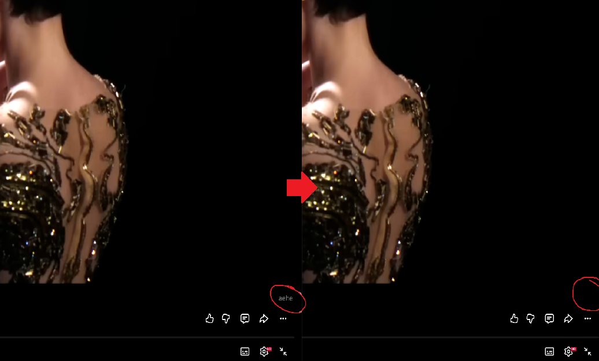

<h1 align="center">

YouTube In-Video Logo Remover

</h1>

A lightweight Chrome extension that automatically removes channel logos displayed on YouTube videos.

---

## 📥 Installation (Developer Mode)

1. Download this repository as ZIP

2. Extract the folder

3. Open Google Chrome

4. Go to Extensions page:

   - Type in the address bar: `chrome://extensions/`
   - Press **Enter**

5. Enable Developer Mode:

   - In the top-right corner of the Extensions page, find the switch called **Developer mode**
   - Turn it ON

6. Click **Load unpacked**

7. Select the extracted folder

---